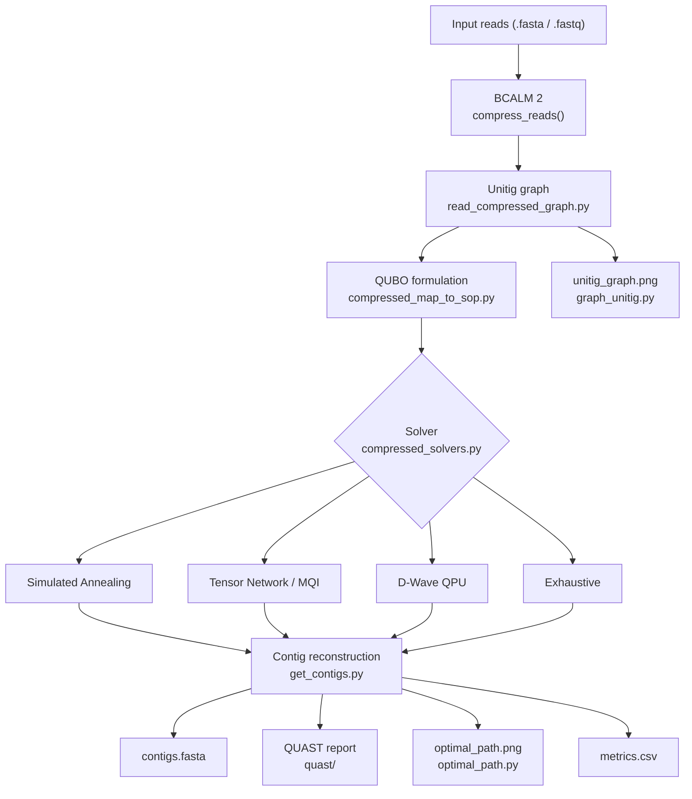

# Genome Assembly with Quantum & Quantum-Inspired Solvers

## Overview

This project assembles DNA sequences from short reads using quantum and quantum-inspired optimisation algorithms. The pipeline compresses a de Bruijn graph using [BCALM 2](https://github.com/GATB/bcalm), formulates the assembly problem as a QUBO (Quadratic Unconstrained Binary Optimisation), and solves it using the [Singularity Optimisation Platform](https://multiversecomputing.com/singularity).

### Pipeline summary

1. **Compress reads** — BCALM 2 builds a compacted de Bruijn graph (unitigs) from the input reads
2. **Formulate QUBO** — Binary variables are created for each edge in the unitig graph; constraints enforce a valid Eulerian path
3. **Solve** — A quantum or quantum-inspired solver selects the optimal set of edges
4. **Reconstruct contigs** — Selected edges are chained into DNA contigs by trimming (k−1)-mer overlaps
5. **Evaluate** — QUAST measures assembly quality against an optional reference genome

### Pipeline flowchart



---

## Project structure

```
use_case/
├── node_attributes.py          # Unitigs data class
├── read_compressed_graph.py    # BCALM 2 FASTA parser
├── compressed_map_to_sop.py    # QUBO formulation (Map_to_SOP)
├── compressed_solvers.py       # Solver wrappers (Compressed_Solver)
├── get_contigs.py              # Contig reconstruction from solver output
├── graph_unitig.py             # Unitig graph visualisation
└── optimal_path.py             # Solution path visualisation

tests/                          # Unit tests (python -m unittest)
main.py                         # CLI entry point
```

---

## Setup

### Requirements

- Docker
- Git

### Environment variables

Create a `.env` file in the project root:

```
TOKEN_NAME=xxxxxxxxx
ACCESS_TOKEN=xxxxxxxx
SINGULARITY_TOKEN=xxxxxxxx
DWAVE_API_TOKEN=xxxxxxxx
```

### Build the Docker image

```bash
source .env
docker compose build --build-arg TOKEN_NAME="$TOKEN_NAME" --build-arg ACCESS_TOKEN="$ACCESS_TOKEN"
```

---

### Build the container
```bash
docker compose up -d
```
## Running the pipeline


Open a shell inside the container:

```bash
docker exec -it project-dev bash
```

Then run `main.py` with the required arguments:

```bash
python main.py --reads PATH --k INT --solver SOLVER [options]
```

### Required arguments

| Argument   | Description |
|------------|-------------|
| `--reads`  | Path to the reads file (`.fasta` or `.fastq`) |
| `--k`      | K-mer size for the de Bruijn graph |
| `--solver` | Solver to use: `simulated_annealing`, `tensor_network`, `dwave_qpu`, or `exhaustive` |

### Optional arguments

| Argument        | Default                      | Description |
|-----------------|------------------------------|-------------|
| `--reference`   | —                            | Path to a reference genome (`.fasta`) for QUAST quality assessment |
| `--abundance`   | `2`                          | Minimum k-mer abundance (filters sequencing errors) |
| `--num-samples` | `50`                         | Number of solver samples |
| `--output`      | `results_YYYYMMDD_HHMMSS`   | Output directory |

### Example

```bash
python main.py \
  --reads use_case/Reads/PRD_basicerrors_fewreads_R1.fastq \
  --k 21 \
  --solver simulated_annealing \
  --reference use_case/reference_genome/Enterobacteria_phage_PRD1.fasta
```

### Output folder

```
results_YYYYMMDD_HHMMSS/
├── contigs.fasta        # Assembled contigs
├── quast/               # QUAST quality assessment (report.tsv, report.pdf, …)
├── unitig_graph.png     # Compacted de Bruijn graph visualisation
├── optimal_path.png     # Solution path visualisation
├── metrics.csv          # Problem and runtime metrics
└── read.unitigs.fa      # Intermediate BCALM 2 output
```

### metrics.csv columns

| Column | Description |
|--------|-------------|
| `num_binary_variables` | Number of binary variables in the QUBO |
| `num_constraints` | Total number of constraints |
| `satisfied_constraints` | Number of constraints satisfied by the best solution |
| `unsatisfied_constraints` | Number of constraints violated |
| `num_contigs` | Number of assembled contigs |
| `num_multi_var_contigs` | Contigs spanning ≥ 2 solver variables |
| `solver_runtime_s` | Time spent in the solver (seconds) |
| `total_time_s` | Total pipeline wall time (seconds) |

---

## Development

All development commands are run inside the Docker container.

### Format code

```bash
make format
```

### Check formatting

```bash
make format_check
```

### Linting and type checking

```bash
make static
```

### Run unit tests

```bash
make test
```

Tests are located in `tests/`. Tests that require `networkx` or `graphviz` are skipped automatically if those packages are not installed.

### Check test coverage

```bash
make test_coverage
```

---

## License

This repository is licensed under the MIT license only.

This repository contains code released for reproducibility of the results reported in De novo assembly of a viral genome using quantum algorithm. It does not contain Singularity Optimization, which is proprietary software and must be obtained separately under a separate license.

No rights to Singularity Optimization, including its source code, binaries, documentation, trademarks, or separately held intellectual property rights, are granted by this repository's license. The MIT applies only to the files in this repository unless otherwise stated.

---

## CI/CD

The GitLab pipeline runs on every push and includes the following stages:

| Stage | Job | Description |
|-------|-----|-------------|
| build | `build-job` | Builds and pushes the Docker image |
| test | `format_check` | Checks code formatting (black, isort) |
| test | `static` | Linting (flake8) and type checking (mypy) |
| test | `test` | Unit tests |
| test | `coverage` | Test coverage report |
| test | `security` | Security scanning (bandit) |

SAST and code quality reports are available as job artefacts on merge requests.
